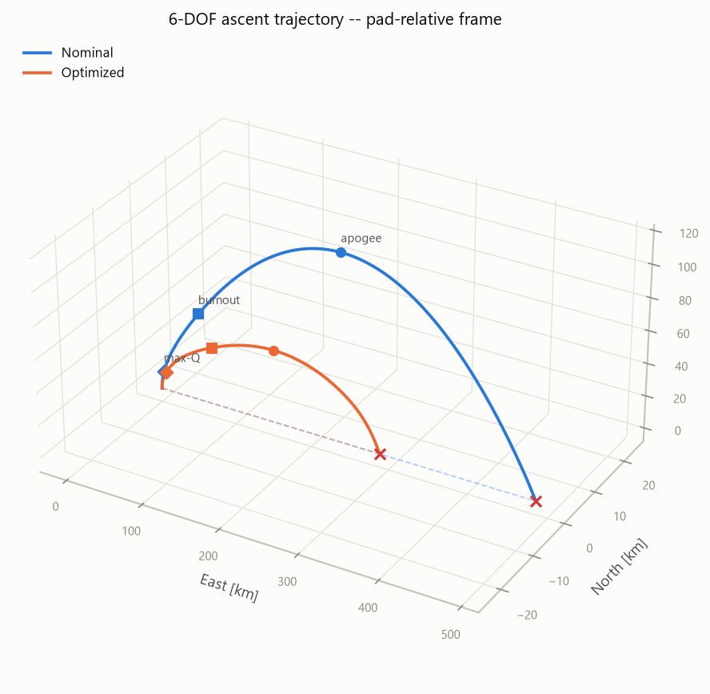
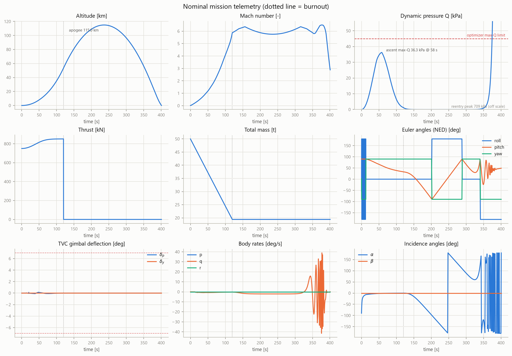
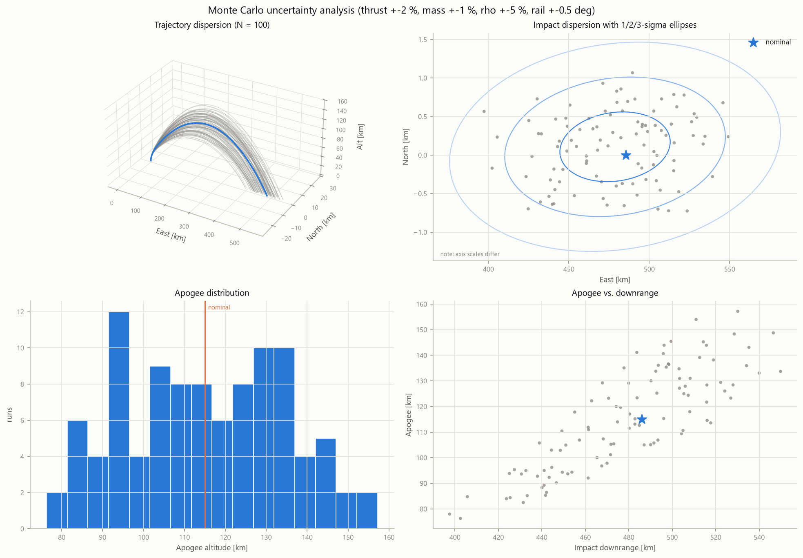

# 6-DOF Rocket Flight Dynamics Simulator

A single-file, physics-rigorous six-degree-of-freedom launch vehicle simulator
in Python — quaternion attitude dynamics, thrust-vector control, gravity-turn
guidance, Monte Carlo dispersion analysis, and constrained trajectory
optimization. No frameworks, no placeholders: one script, the standard
scientific stack, and a full mission analysis on every run.



## Quick start

```bash
pip install -r requirements.txt
python rocket_sim_6dof.py
```

One run (~90 s on a typical laptop) executes the complete analysis sequence:

1. **Physics self-verification** — US Standard Atmosphere 1976 checked against
   published tables, quaternion algebra identities, mass/propulsion consistency.
2. **Nominal 6-DOF flight** — powered ascent, coast to apogee, ballistic
   return to impact.
3. **Trajectory optimization** — SLSQP over the pitchover program
   (kick time and kick angle), maximizing insertion velocity subject to an
   ascent max-Q constraint. The optimum rides the constraint boundary.
4. **Monte Carlo engine** — 100 dispersed flights (thrust ±2 %, lift-off mass
   ±1 %, air density ±5 %, launch rail elevation/azimuth ±0.5°).
5. **Visualization** — three figures rendered and saved automatically:
   3-D trajectory, nine-panel telemetry dashboard, dispersion suite.

## Physics model

| Domain | Model |
|---|---|
| State | 13-element rigid-body state (ECI position/velocity, body→inertial quaternion, body rates) + 2 TVC actuator states |
| Attitude | Quaternion kinematics `q̇ = ½ q ⊗ [0, ω]`, gimbal-lock free, renormalized every derivative evaluation |
| Mass | Continuous propellant depletion; bottom-draining tank gives time-varying CG and full inertia tensor I(t), including the −İω torque and nozzle jet damping |
| Atmosphere | Seven-layer US Standard Atmosphere 1976 to 86 km (base pressures integrated from the defining lapse rates), power-law wind shear |
| Gravity | Central inverse-square field g(h) = g₀(Re/(Re+h))² |
| Aerodynamics | Mach-dependent C_D and center-of-pressure tables; total-angle-of-attack normal force (equivalent to C_L(α), C_Y(β) at small angles); C_lp, C_mq, C_nr rate damping |
| Propulsion | Ambient-pressure thrust law T = T_vac − p·A_e; 750 kN / Isp 300 s stage burning 120 s |
| Control | PD attitude controller commanding a 2-axis gimbal through the exact nozzle geometry inversion, with hard stops, slew-rate limit, and actuator lag |
| Guidance | Vertical rise → half-cosine pitchover → velocity-tracking gravity turn |
| Integration | `scipy.integrate.solve_ivp` adaptive RK45, phase-split at engine cutoff, event-terminated at apogee/impact |

## Telemetry dashboard



## Monte Carlo dispersion analysis



The dispersion results reproduce two classic gravity-turn phenomena: extreme
sensitivity of apogee to the effective kick angle (a 0.5° rail error moves
apogee ~20 km), and downwind weathercocking — the open-loop turn absorbs most
of a launch-azimuth error into the wind plane, producing the strongly
elongated impact ellipse.

## Configuring your own missions

Everything is parameterized in two dataclasses near the top of the file:

- `Vehicle` — masses, propulsion, geometry, aero tables, TVC actuator limits.
- `SimParams` — launch site, guidance program, controller gains, wind,
  dispersion magnitudes.

Module-level constants control the analysis scale (`N_MONTE_CARLO`,
`Q_LIMIT_PA`, `RNG_SEED`). The script is import-safe: `import rocket_sim_6dof`
exposes `simulate()`, `run_monte_carlo()`, and `optimize_pitchover()` for use
in notebooks or your own studies without triggering the full analysis.

## Modeling assumptions

Documented in the module header: non-rotating spherical Earth (appropriate for
suborbital flights), no roll control (a pure 2-axis gimbal cannot torque
roll), engine cutoff on the 120 s command with residual propellant, and an
exponential atmosphere continuation above 86 km.

## Requirements

Python ≥ 3.10 with `numpy`, `scipy`, `matplotlib`.

## License

MIT — see [LICENSE](LICENSE).
